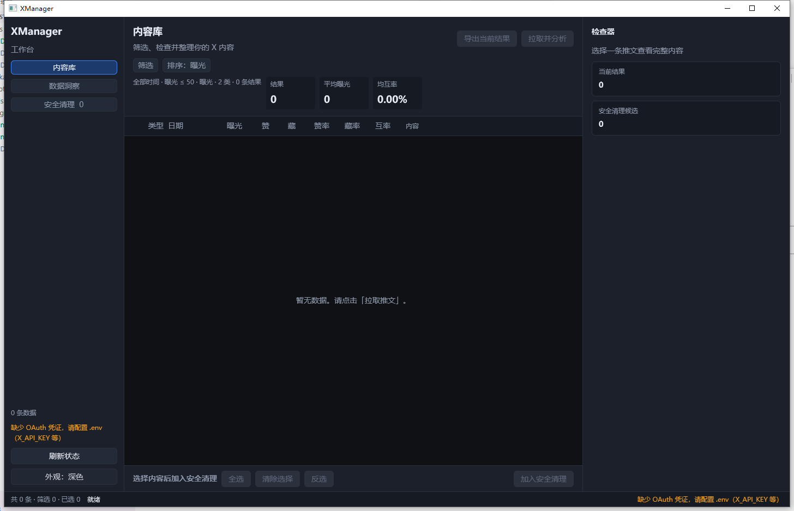
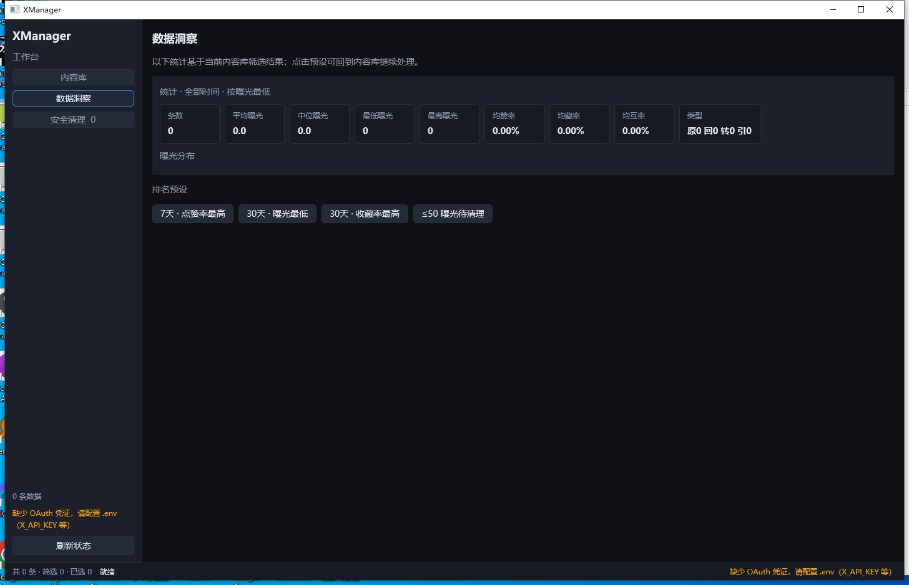
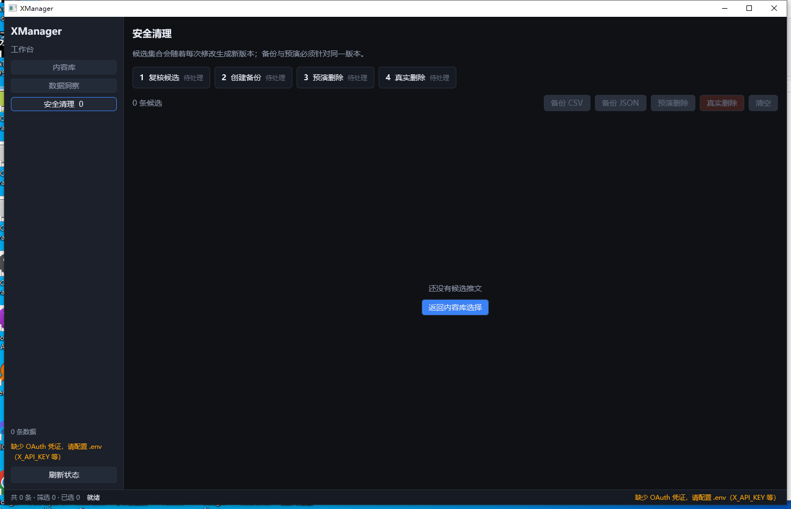

# XManager

快速筛选并管理你自己**访问量较低**的 X（推特）推文。

主程序为 **Rust + GPUI** 桌面应用；领域逻辑在 `xmanager-core`。

[](https://github.com/nicechencs/XManager/actions/workflows/ci.yml)

## 功能

- 拉取自己的推文（含 `impression_count` **曝光**）
- **时间段**：24h / 7天 / 30天 / 90天 / 180天 / 360天 / 全部
- **帖子类型标记**：原创 / 回帖 / 转发 / 引用（可筛选）
- **排序指标**：曝光、点赞率、收藏率、互动率、转发率、回复率、互动量、日期
- **最高 / 最低** + Top-N（例如 7 天点赞率最高 Top20）
- 快捷：低曝光阈值（≤10/20/50/100）
- 三段工作台：**内容库** / **数据洞察** / **安全清理**
- 筛选改完立即生效；拉取条数与「含转发」单独标为下次拉取才生效
- 内容库以正文为主扫列表；点赞 / 收藏 / 比率放在检查器
- 数据洞察看全部已同步数据的分布，当前筛选是切片；点直方图或预设回到内容库
- 导出 CSV / JSON（内容库 / 洞察 / 清理备份）
- 浅色 / 深色外观切换；字号 / 行高 / 间距见 [docs/DESIGN.md](docs/DESIGN.md)
- **安全删除**：内容库勾选后点「删除选中」→ 确认一次（自动备份到导出目录）→ 立即删除，不必先去安全清理。安全清理仍可作为可选复核盘。遇 HTTP 429 立即停止后续删除。
- 响应式：宽屏在选中推文后才打开检查器；中屏紧凑导航；窄屏筛选/检查器为全高覆盖层，列表改为带字段标签的卡片
- 列表虚拟化；刷新中保留旧数据并提示；空状态区分无凭证 / 无数据 / 无匹配

## 界面预览

主界面以深色主题展示内容库、筛选与批量管理：

<p align="center">
  
</p>

<table>
  <tr>
    <td align="center"><strong>数据洞察</strong></td>
    <td align="center"><strong>安全清理</strong></td>
  </tr>
  <tr>
    <td></td>
    <td></td>
  </tr>
</table>

## 目录结构

```
XManager/
├── Cargo.toml                 # workspace
├── .env.example
├── run.sh                     # macOS / Linux 启动
├── run.bat                    # Windows 启动
├── packaging/                 # 发版 zip 说明与 macOS Info.plist
├── scripts/                   # Windows / macOS 打包
├── crates/
│   ├── xmanager-core/         # API · 筛选 · 导出
│   ├── xmanager-cli/          # 命令行（JSON stdout）
│   └── xmanager-ui/           # GPUI 桌面端（二进制 xmanager）
└── docs/ARCHITECTURE.md
└── docs/DESIGN.md             # 字号 / 间距 / 交互约定
└── docs/LOGGING.md            # 日志命名 / 保留 / 事件目录
└── docs/RELEASE.md            # tag / GitHub Actions 发版
```

详见 [docs/ARCHITECTURE.md](docs/ARCHITECTURE.md)、[docs/DESIGN.md](docs/DESIGN.md)、[docs/LOGGING.md](docs/LOGGING.md) 与 [docs/RELEASE.md](docs/RELEASE.md)。

## 前置条件

1. **Rust** stable（已在 `1.89+` 验证）
2. **X Developer App**：[developer.x.com](https://developer.x.com) / [console.x.com](https://console.x.com)
3. **OAuth 1.0a 四件套**，删除需要 **Read and Write**
4. **Windows / macOS / Linux** 均可编译运行（GPUI 0.2.2：macOS 用 Metal，Linux 用 Wayland 或 X11 + Vulkan）

> API 多为按量付费；读自己的时间线一般为 owned reads。时间线通常最多约最近 3200 条。

## 配置

```bash
cp .env.example .env
```

打开 [https://console.x.com](https://console.x.com) → 选中 Project/App → **Keys and tokens**。新控制台生成后会把密钥藏起来，**Regenerate 只会再显示一次**。

**控制台标签 ≠ `.env` 变量名。** 最常见翻车：把 User Access Token（以 `{user_id}-` 开头）贴进 `X_API_KEY` → HTTP 401，侧栏还可能只说「缺少凭证」或「已配置」。

| 控制台位置 | 控台英文名 | 也可能写成 | 填入变量 | 长相 |
|---|---|---|---|---|
| console.x.com → 你的 App → Keys and tokens → OAuth 1.0a Keys → Consumer Key | Consumer Key / API Key | API Key | `X_API_KEY` | 约 25 位，**没有**「数字ID-」 |
| 同页 Consumer Secret | Consumer Secret / API Key Secret | API Secret | `X_API_SECRET` | 较长一些 |
| 同页 Access Token（For @yourhandle · Read and write） | Access Token | User Access Token | `X_ACCESS_TOKEN` | `{user_id}-....` |
| 同页 Access Token Secret | Access Token Secret | | `X_ACCESS_TOKEN_SECRET` | 较长，没有数字 ID 前缀 |
| App-only Bearer（可选，本工具不用） | Bearer Token | | `X_BEARER_TOKEN` | 很长 |

还要同时满足：

1. **User authentication = Read and write**，然后 **重新生成 Access Token**。只改权限、不重生，旧 Token 仍是只读。
2. **按量付费（pay-per-use）额度** 开着，否则读自己的时间线会 403。
3. 侧栏「凭证已配置」只检查四项是否非空，**不会联网 whoami**。点「刷新状态」才做一次真实校验。

可选日志变量：`XMANAGER_LOG_DIR`（不设则跟数据目录下的 `logs/`）、`XMANAGER_LOG_LEVEL`（`debug` / `info` / `warn` / `error`）、`XMANAGER_DATA_DIR`（同时改日志和导出的根目录）。

### `.env` / 日志 / 导出放哪

桌面端和 CLI 会找**第一个存在的** `.env`（文件里的值覆盖已有环境变量）：

1. 可执行文件旁边（macOS `.app` 还会看 `.app` 所在文件夹和 `Contents/Resources`）。`cargo` 的 `target/` 目录会跳过，避免开发时误读。
2. `XMANAGER_DATA_DIR/.env`（若设置了该变量）
3. 当前工作目录，以及向上两级（仓库里 `cargo run` 仍然可用）
4. 用户配置目录：Windows `%APPDATA%\XManager`，macOS `~/Library/Application Support/XManager`

日志和导出（`logs/`、`exports/`）：

- 在仓库里跑（当前目录有 `Cargo.toml` / `.env` / `.env.example`）：仍写在当前目录
- 打包后的程序：可执行文件旁边若已有 `.env`（解压即用的 zip），就写在那一档；否则写到上面的用户配置目录
- `XMANAGER_LOG_DIR` 只覆盖日志目录

### Developer Portal 简要步骤

1. 打开 https://console.x.com → 选 Project + App → Keys and tokens  
2. 开通按量付费访问  
3. User authentication 设为 **Read and write**，再 **Regenerate** User Access Token  
4. 按上表把 Consumer Key/Secret 与 Access Token/Secret **对号**写入 `.env`（不要交叉粘贴）

## 下载

正式包在 [GitHub Releases](https://github.com/nicechencs/XManager/releases)：

- Windows：`XManager-*-windows-x64.zip`（解压后双击 `XManager.exe`）
- macOS：`XManager-*-macos-universal.zip`（Intel 与 Apple Silicon 同一个 `.app`）

构建**未签名**。Windows 若出现 SmartScreen，选「更多信息」→「仍要运行」。macOS 若提示无法验证开发者：

```bash
xattr -cr XManager.app
open XManager.app
```

或按住 Control 点图标 → 打开。把 `.env` 放在程序旁边或用户配置目录，见上文。发版步骤见 [docs/RELEASE.md](docs/RELEASE.md)。

## 构建与运行

本仓库是纯 Rust，**macOS、Linux、Windows 都可以执行**。

| 入口 | 适用场景 |
|------|----------|
| `xmanager-cli` | 无 GUI 依赖；无显示器的 Linux / CI / 自动化也能跑 |
| `xmanager`（桌面端） | 需要图形会话：macOS（Metal）、Linux（Wayland 或 X11 + Vulkan）、Windows |

### 系统依赖

**所有平台**

1. Rust stable（已在 `1.89+` 验证）：https://rustup.rs
2. `.env`：开发时放仓库根目录；打包后放程序旁边或用户配置目录（见上文）

**macOS**

- 安装 [Xcode](https://developer.apple.com/xcode/) 或 Command Line Tools（桌面端用 Metal 渲染）：

```bash
xcode-select --install
```

**Linux（Debian / Ubuntu 示例）**

桌面端编译需要 clang、pkg-config，以及 Wayland/X11、Vulkan、字体相关开发包：

```bash
sudo apt install -y clang pkg-config \
  libxkbcommon-dev libxkbcommon-x11-dev \
  libwayland-dev libx11-dev libx11-xcb-dev libxcb1-dev \
  libfontconfig-dev libfreetype-dev \
  libvulkan-dev libvulkan1 mesa-vulkan-drivers
```

运行桌面窗口还需要：

1. 图形会话（`WAYLAND_DISPLAY` 或 `DISPLAY`）
2. 可用的 Vulkan 设备（本机 GPU 驱动；无独显的虚拟机可装 `mesa-vulkan-drivers` 走 lavapipe 软件渲染）

SSH / CI / 无显示器环境请用 CLI，不要启动桌面窗口。GPUI 在找不到 GPU 时会直接退出。

**Windows**

安装 Rust（MSVC 工具链）即可；可用 `run.bat`。

### 启动脚本

macOS / Linux：

```bash
chmod +x run.sh          # 只需一次
./run.sh                 # release 编译并启动（默认）
./run.sh debug           # debug 编译并启动
./run.sh bin             # 只跑已有 release 二进制，不重新编译
./run.sh debug bin       # 只跑已有 debug 二进制
./run.sh cli -- --help   # 命令行
```

Windows 可在仓库根目录双击或执行：

```bat
run.bat              :: release 编译并启动（默认）
run.bat debug        :: debug 编译并启动
run.bat bin          :: 只跑已有 release 二进制，不重新编译
run.bat debug bin    :: 只跑已有 debug 二进制
```

或直接用 Cargo：

```bash
# 在仓库根目录
cargo run -p xmanager-ui --release
# 或
cargo run --release
# 已编译时（macOS / Linux）
./target/release/xmanager
# Windows
./target/release/xmanager.exe
```

首次会编译 GPUI 及其依赖，耗时较长，属正常现象。

## 命令行（自动化 / 测试）

桌面窗口没有控制台。自动化走独立二进制 `xmanager-cli`，**stdout 为 JSON**。

```bash
cargo run -p xmanager-cli -- --help
# 或
./run.sh cli -- --help      # macOS / Linux
run.bat cli -- --help       # Windows
```

| 命令 | 网络 | 作用 |
|------|------|------|
| `creds` | 否 | 检查四项 OAuth 是否已配置 |
| `filter` / `summarize` / `export` | 否 | 对本地推文 JSON 筛选 / 统计 / 导出 |
| `delete` | 否（默认） | 打印将删的 id；加 `--yes` 才真删 |
| `whoami` / `fetch` | 是 | 调 X API |

```bash
# 不打 API：用夹具测筛选
cargo run -p xmanager-cli -- filter --input tweets.json --max-views 20

# 凭证检查（可指定 .env）
cargo run -p xmanager-cli -- creds --env .env

# 预演删除（不会调用 DELETE）
cargo run -p xmanager-cli -- delete --ids 111,222
```

退出码：`0` 成功，`2` 缺凭证，`3` API/网络/限速（`code: rate_limited` 含 `retry_after_secs`），`1` 其它错误。

```bash
cargo test -p xmanager-cli          # 离线
cargo test -p xmanager-cli -- --ignored   # 可选：打真实 API（whoami）
```

### 界面操作

1. 确认侧栏凭证状态为已配置  
2. 在**内容库**打开筛选：时间段、类型、排序、Top-N、低曝光快捷  
3. 打开 **筛选**：改时间、类型、曝光或排序后列表立即更新；需要更多数据时再点 **拉取并分析**  
4. 勾选左侧方框（或点开一条）→ **删除选中** → 确认一次（自动备份到导出目录，仍留在内容库）  
5. 可选：需要复核时再 **加入安全清理**，在**安全清理**点 **删除 N 条**（自动备份并预演），再确认一次

快捷键：`J` / `K` 或方向键上下条，空格勾选当前条，`/` 打开筛选，`Esc` 关闭抽屉/检查器/错误，`1` `2` `3` 切换内容库 / 洞察 / 清理。列表表头可点击切换排序。字号与间距标准见 [docs/DESIGN.md](docs/DESIGN.md)。

## 领域库（无 UI）

```bash
cargo test -p xmanager-core
```

```rust
use xmanager_core::{Settings, XClient, FilterOptions, filter_tweets, export_csv};

let client = XClient::new(Settings::load()?)?;
let (_me, tweets) = client.fetch_own_tweets(100, true, true)?;
let low = filter_tweets(&tweets, &FilterOptions::low_views(50));
export_csv(&low, "exports/low.csv")?;
```

## 注意

- **删除不可恢复**，务必先导出或 dry-run  
- 曝光优先读用户上下文的 `non_public_metrics.impression_count`，否则用 `public_metrics`；字段缺失时按 0，不中断解析  
- 桌面端默认先筛「曝光 ≤ 50、不含回帖/转发」，便于找低曝光内容；筛选后若为 0 条，点芯片或「清除筛选」即可看到全部拉取结果  
- 注意 API 速率限制与费用；429 时界面不会长时间卡住等待  
- 诊断与删除审计写在 `logs/`（app 保留 14 天，audit 保留 90 天）；不含密钥与推文正文 

## License

MIT
